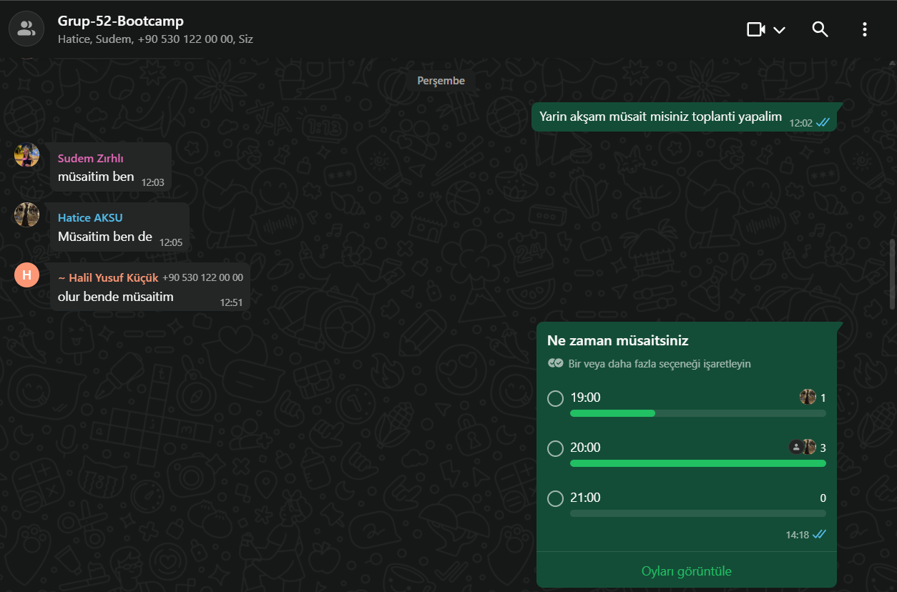
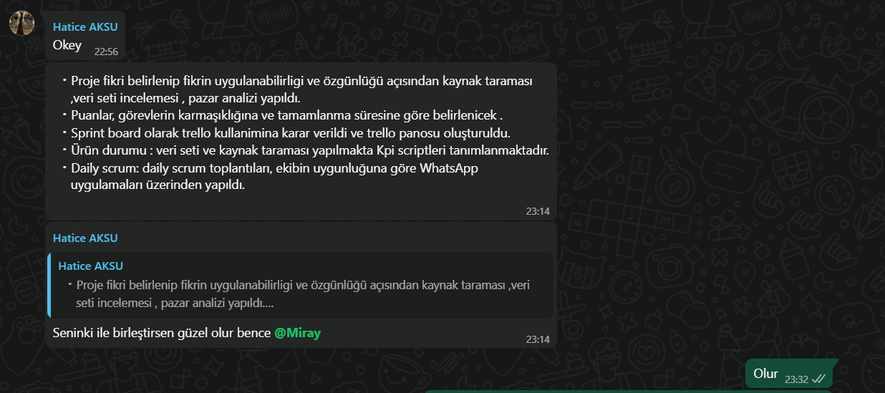
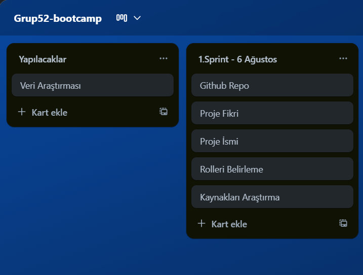
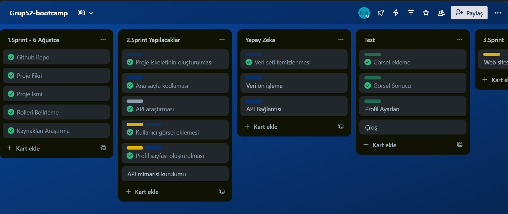
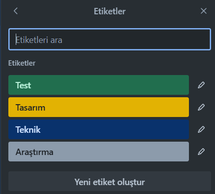
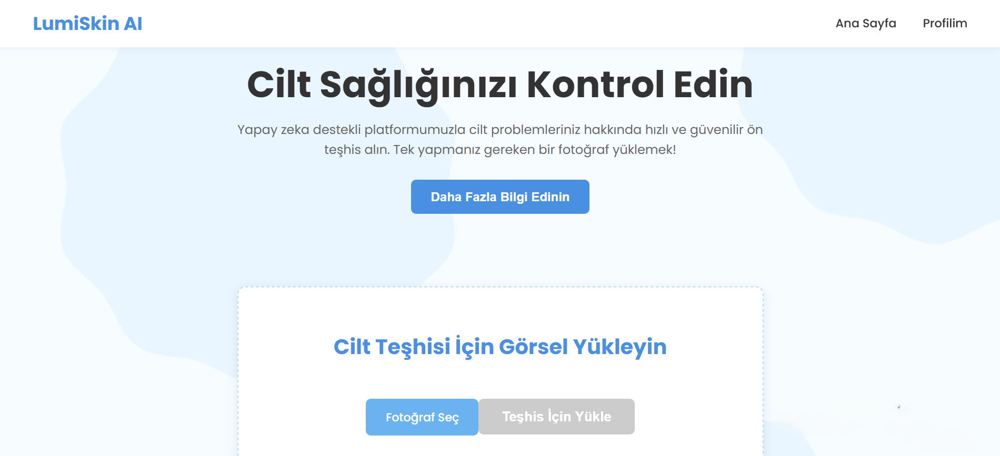
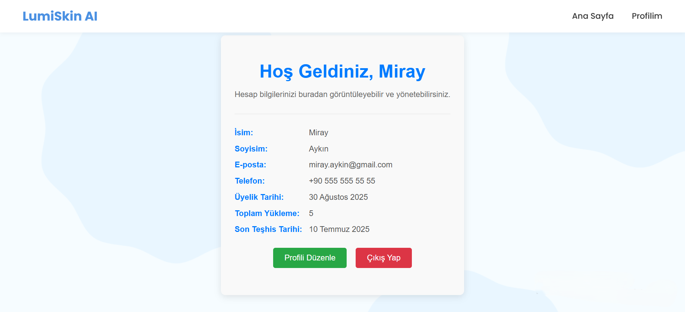

# Sprint 1

## Sprint Notları
  
  - Proje fikri belirlendi. 
  - Fikrin uygulanabilirliği ve özgünlüğü açısından: kaynak taraması yapıldı, veri seti incelemeleri gerçekleştirildi.
  - Pazar analizi tamamlandı.
  - Benzer projeler, akademik yayınlar ve mobil sağlık uygulamaları incelendi.
  - Projenin etik uygunluğu ve medikal doğruluğu göz önünde bulundurularak ön analizler yapıldı.
 
<strong> Veri Kaynakları</strong>  
- Kaggle ve ISIC Archive, proje için temel veri kaynakları olarak belirlenmiştir.
 
<strong> Kullanılan Yapay Zeka</strong>  
- Yapay zeka motoru olarak Gemini kullanılmasına karar verilmiştir.

---

<strong> Daily Scrum</strong>

    
Daily scrum toplantıları, ekibin uygunluğuna göre WhatsApp ve Google Meet uygulamaları üzerinden yapıldı.
 
  
  

---

<strong>Puanlama Sistemi</strong>

### Sprint Puanlama ve Tamamlama Mantığı

Toplam hedef puan: **1000 puan**  
Puanlar, her sprintte yapılacak işlerin:

- Kapsamı  
- Teknik zorluk derecesi  
- Proje üzerindeki etkisi gibi faktörler göz önünde bulundurularak dağıtılmıştır.

🔹 **Sprint 1 – 250 Puan**  
- Proje fikri belirlendi  
- Kaynak ve veri seti araştırması yapıldı  
- Uygulanabilirlik ve özgünlük analizleri tamamlandı  
- Gerekli araçlar ve kaynaklar belirlendi

Hedef başarıyla tamamlandı.

---

🔹 **Sprint 2 – 350 Puan**  
- Yapay zeka modeli geliştirilecek  
- Veri seti işlenecek  
- Sınıflandırma ve analiz fonksiyonları yazılacak  
- API mimarisi kurulacak ve test edilecek
- Web sitesi geliştirilecek.

 Odak: Teknik geliştirme ve yapay zeka entegrasyonu

---

🔹 **Sprint 3 – 400 Puan**  
- Kullanıcı arayüzü geliştirilecek  
- Arayüz–model–API entegrasyonu yapılacak  
- Sistem genel testleri gerçekleştirilecek  
- Minimum çalışır ürün (MVP) sunulacak

Odak: Entegrasyon ve final ürünün ortaya çıkarılması

---

<strong>Sprint Board</strong>

- Sprint board yönetimi için **Trello** kullanımı tercih edildi.  
- Trello panosu oluşturuldu ve ekip üyeleri eklendi.  
 

---
## Ürün Durumu

- Veri seti ve kaynak taramaları halen devam etmektedir.  
- KPI (Anahtar Performans Göstergeleri) için gerekli scriptlerin tanımlanmasına başlanmıştır.
- Kullanıcı arayüzünün temel düzeni ve tasarım prensipleri netleştirilmiştir.

  

---

<strong>Sprint Review</strong>

Ekiple bir toplantı gerçekleştirildi. Proje fikri ekip tarafından olumlu karşılandı ve nasıl geliştirileceği üzerine fikir alışverişinde bulunuldu.  
Sprint süresince uygulamanın içeriği detaylandırıldı, eksikler tespit edildi ve notlar alındı.  
Görev dağılımı yapıldı; ancak görevlerin sürelerine göre yeniden planlanması gerektiği not edildi.

**Sprint Review Katılımcıları:** Hatice Aksu, Sudem Zırhlı, Miray Aykın

<strong> Sprint Retrospective</strong>

- Görev paylaşımı iyiydi, ancak süre planlaması yetersiz kaldı. Bu nedenle ikinci sprint için daha ayrıntılı ve gerçekçi bir zaman planlaması yapılmasına karar verildi.  
- Trello ve Gemini araçları etkili bir şekilde kullanıldı.  
- Kaggle ve ISIC veri kaynaklarının ikinci sprintte daha aktif ve derinlemesine kullanılmasına yönelik planlamalar yapıldı.

# Sprint 2
## Sprint Notları
  
  - Projenin teknik altyapısını oluşturmak için genel proje iskeleti belirlendi.
  - Yapay zeka modelinin eğitimi için Kaggle ve ISIC Archive veri setleri indirildi, temizlendi ve sınıflandırma için uygun hale getirildi.
  - Modelin kullanıcıdan görsel alarak analiz yapabileceği bir API mimarisi geliştirildi.
  - Benzer projeler, akademik yayınlar ve mobil sağlık uygulamaları incelendi.
  - Web sitesi tasarımına geçilmeye karar verildi.
  - Web sitesinin içeriği ve sayfa yapıları tanımlandı.
 

  

<strong> Daily Scrum</strong>

    
Daily scrum toplantıları, ekibin uygunluğuna göre WhatsApp ve Google Meet uygulamaları üzerinden yapıldı.

---

<strong>Puanlama Sistemi</strong>

### Sprint Puanlama

**Sprint 2 – 350 Puan**  
- Yapay zeka modeli geliştirilecek  
- Veri seti işlenecek  
- Sınıflandırma ve analiz fonksiyonları yazılacak  
- API mimarisi kurulacak ve test edilecek
- Web sitesi geliştirilecek.

  
 Hedef başarıyla tamamlandı.

---

<strong>Sprint Board</strong>

 

---
## Ürün Durumu
Trello etiketleri; Araştırma, Tasarım, Test ve Teknik olarak sınıflandırılmıştır. Geliştirme sürecinde ihtiyaç duyuldukça yeni etiketler eklenecek veya değiştirilecektır.

---

<strong>Sprint Review</strong>

- Web sitesi tasarımına karar verildi.
- Kayıt ve giriş sistemleri tasarlandı.
- Anasayfa içeriği belirlendi.
- Profil sayfası belirlendi.
- Proje iskeleti oluşturuldu; temel dosya yapısı tanımlandı.
- Yapay zeka modeli oluşturularak Kaggle ve ISIC Archive veri setleriyle eğitildi.
- Veri ön işleme süreci tamamlandı; etiketleme ve sınıflandırma hazırlıkları yapıldı.
- Sınıflandırma ve analiz fonksiyonları yazıldı; temel çıktı analizi başarıyla çalıştırıldı.
- API mimarisi kuruldu ve yapay zeka modeli ile bağlantısı test edildi.

**Sprint Review Katılımcıları:** Hatice Aksu, Miray Aykın

<strong> Sprint Retrospective</strong>

- Takım içinde görev dağılımı netti, ancak bazı görevlerde zaman tahminleri yetersiz kaldı. Gelecek sprintlerde daha dikkatli zaman tahminleri yapılmalı.
- Sprint boyunca yapılan ilerleme yeterliydi ama ilerlemeyi görselleştirmek için Trello daha aktif kullanılması gerekiyor.
- Proje içinde kaynak yönetimi zaman zaman karmaşaya yol açtı. Dosya yönetim sistemine daha fazla özen gösterilmesi gerekiyor.

